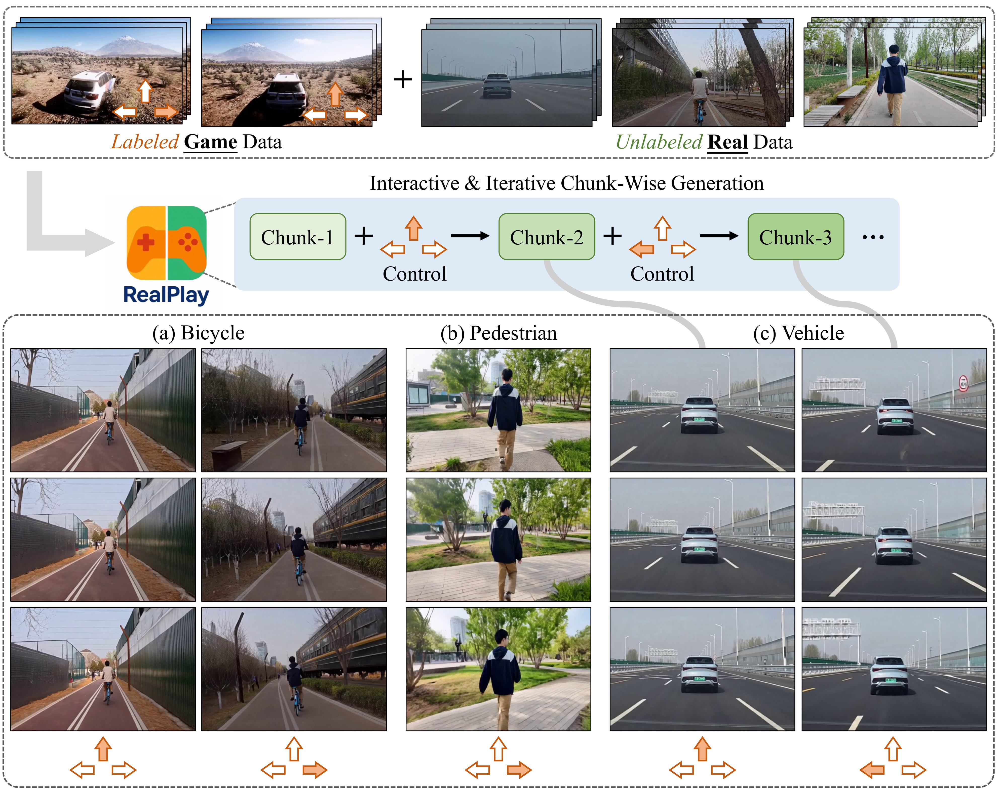

# From Virtual Games to Real-World Play

[**Paper**](https://wenqsun.github.io/RealPlay/) | [**Project Page**](https://wenqsun.github.io/RealPlay/)

Official implementation of RealPlay: From Virtual Games to Real-World Play

Wenqiang Sun*, Fangyun Wei*, Jinjing Zhao, Xi Chen,, Zilong Chen, Hongyang Zhang, Jun Zhang, Yan Lu.

 All Code will be released soon... 🏗️ 🚧 🔨

Abstract: *We introduce RealPlay, a neural network-based real-world game engine that enables interactive video generation from user control signals. Unlike prior works focused on game-style visuals, RealPlay aims to produce photorealistic, temporally consistent video sequences that resemble real-world footage. It operates in an interactive loop: users observe a generated scene, issue a control command, and receive a short video chunk in response. To enable such realistic and responsive generation, we address key challenges including iterative chunk-wise prediction for low-latency feedback, temporal consistency across iterations, and accurate control response. RealPlay is trained on a combination of labeled game data and unlabeled real-world videos, without requiring real-world action annotations. Notably, we observe two forms of generalization: (1) control transfer—RealPlay effectively maps control signals from virtual to real-world scenarios; and (2) entity transfer—although training labels originate solely from a car racing game, RealPlay generalizes to control diverse real-world entities, including bicycles and pedestrians, beyond vehicles.*

    

